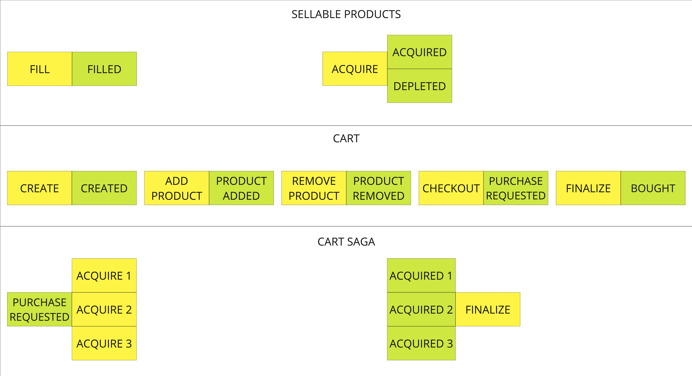

# Axon Framework example

## Getting started

## Axon on db vs Axon Server
- You cannot send **Commands**, receive **Events** or send **Queries** on different microservices
- **Subscription query** not supported
- **Deadlines** need a thirty part scheduling library to work

## Event sourcing
- **Data Change Representation:** Instead of storing just the current state of the data, events represent state changes.

- **Immutable Events:** Once an event is recorded, it cannot be changed.

- **Event Store:** Events are stored in an event store, a log or database optimized for append operations.

- **Reconstruction:** The current state is derived by replaying events from the event store.

- **Audit Trail:** Provides a complete history of all changes to the system's state.

- **Scalability:** Allows for distributed systems and supports scaling by separating reads and writes.

- **Flexibility:** Enables easy implementation of new features and changes by replaying events with updated logic.

## CQRS

- **Command and Query Separation:** Distinguishes between operations that modify state (commands) and operations that return a result (queries).

- **Command Model and Query Model:** Maintains separate models optimized for updating and querying, reflecting the specific needs of each operation.

- **Write-Side (Command Side):** Handles commands to update or modify the system state.

- **Read-Side (Query Side):** Handles queries to retrieve data for presentation.

- **Asynchronous Communication:** Commands and events are often processed asynchronously to achieve scalability and responsiveness.

- **Decoupling:** Decouples the update and query components, allowing them to evolve independently.

- **Optimization:** Enables optimization of data structures and storage mechanisms for read and write operations independently.

- **Event Sourcing:** Often used in conjunction with CQRS, where events represent state changes and are stored in an event store.

- **Scalability:** Allows for scaling the write and read components independently based on their specific requirements.

- **Consistency Models:** May lead to eventual consistency between the command and query models.

## Event storming
